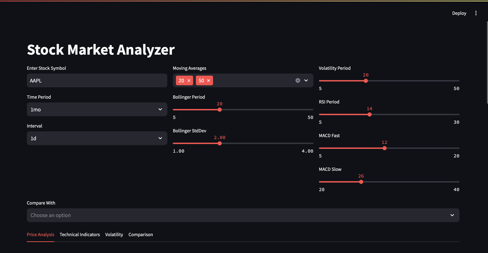
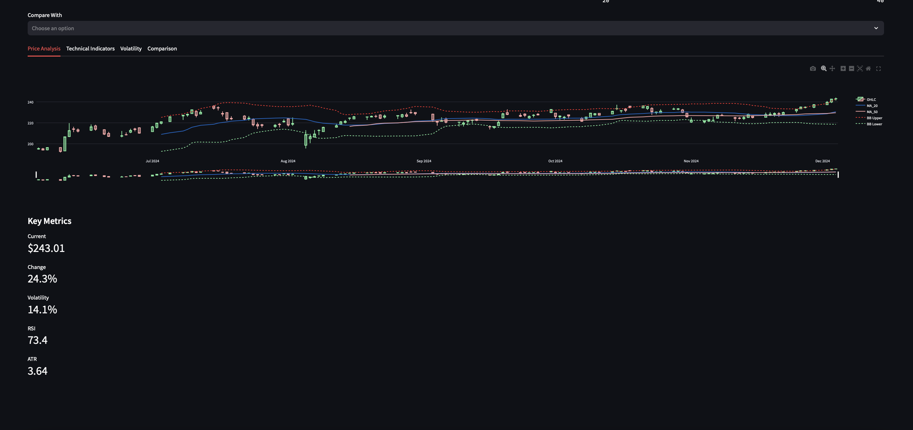
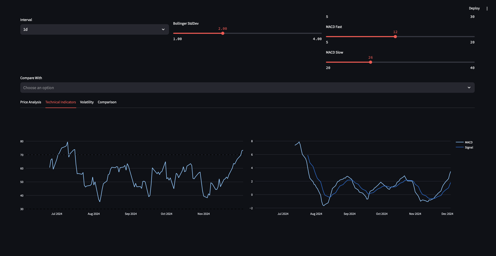
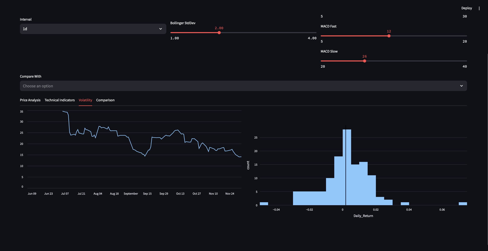
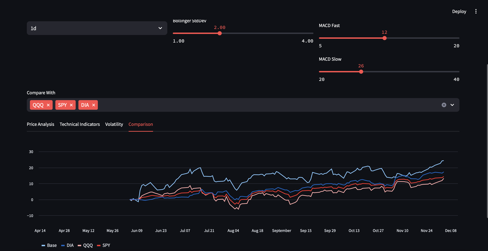

Welcome to Stock Market Analyzer! Check it out [here](LINK).

Enter a stock symbol to learn more about it. You can change the time period, moving average, bollinger period & standard deviation, volitality period, RSI period, and the MACD fast and slow indicators! Too much?

Now let's checkout the dashboard, full of interactive widgets!

See an anlysis of the price over the range you selected as well as the key metrics.

Check out some technical indicators.

How volatile is the stock?

Compare three popular exchange-trade funds.

You can save any of the widgets as an SVG or PNG, or view the source code.